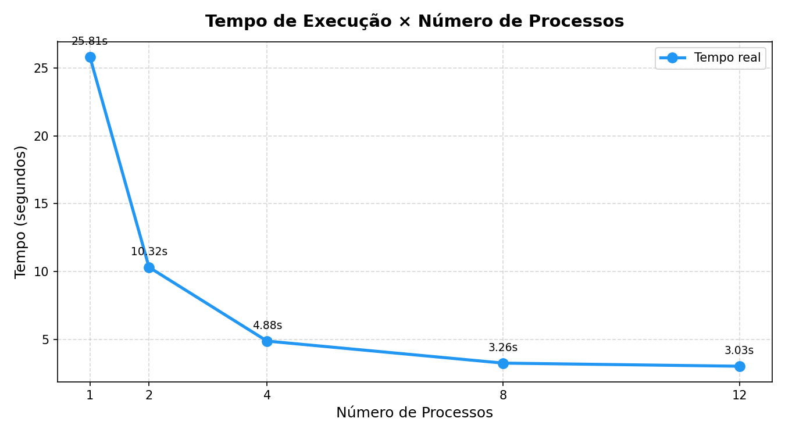
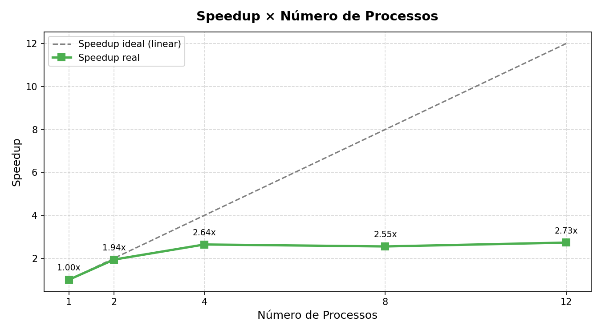
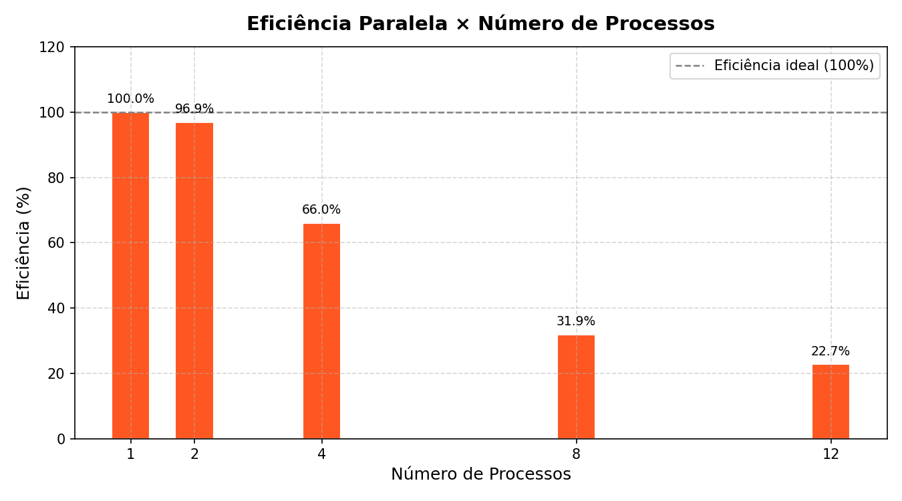
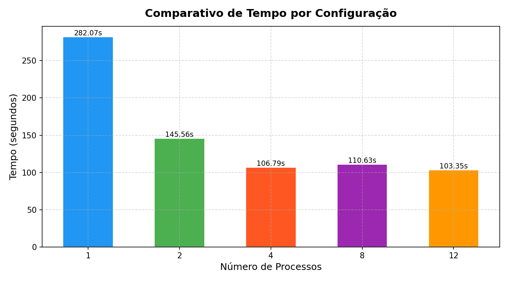
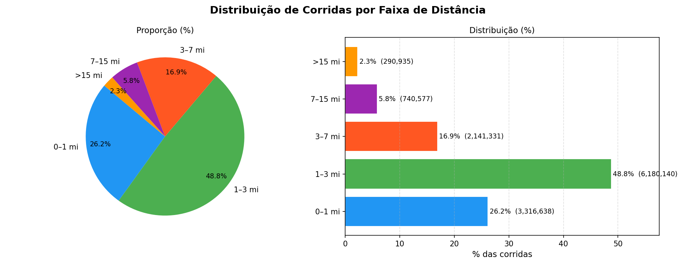
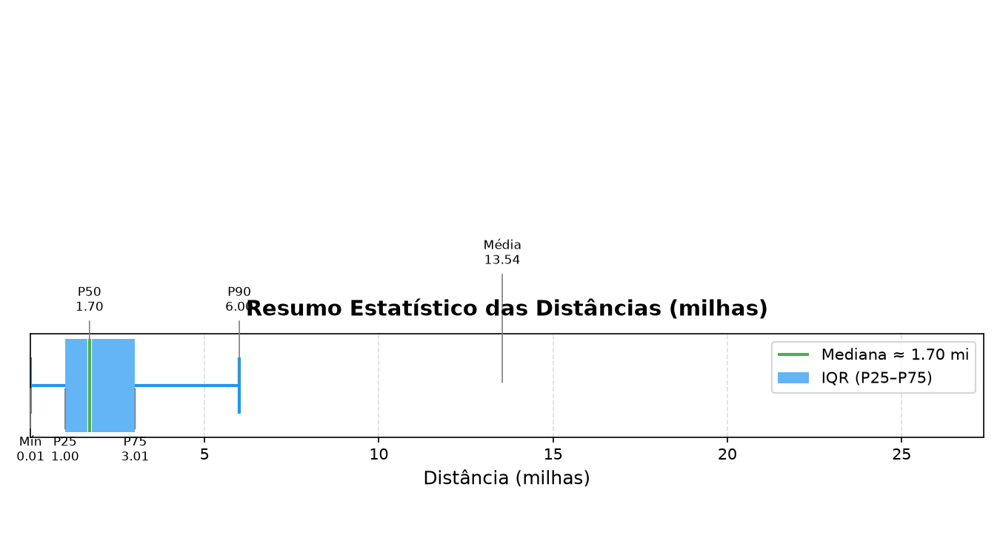

# 🚕 NYC Yellow Taxi Trip Data
## Análise de Dados com Programação Concorrente e Distribuída

> Projeto acadêmico — Programação Concorrente e Distribuída  
> Dataset: [NYC Yellow Taxi Trip Data — Kaggle](https://www.kaggle.com/datasets/elemento/nyc-yellow-taxi-trip-data/data)

---

## Sumário

1. [Sobre o Tema](#1-sobre-o-tema)
2. [Dataset](#2-dataset)
3. [Métricas Calculadas](#3-métricas-calculadas)
4. [Estratégia de Paralelismo](#4-estratégia-de-paralelismo)
5. [Estrutura do Projeto](#5-estrutura-do-projeto)
6. [Ambiente de Execução](#6-ambiente-de-execução)
7. [Pré-requisitos e Instalação](#7-pré-requisitos-e-instalação)
8. [Como Executar](#8-como-executar)
9. [Speedup e Resultados do Benchmark](#9-speedup-e-resultados-do-benchmark)
10. [Métricas e Distribuição das Corridas](#10-métricas-e-distribuição-das-corridas)
11. [Análise de Desempenho](#11-análise-de-desempenho)
12. [Gráficos Complementares](#12-gráficos-complementares)
13. [Conclusão](#13-conclusão)

---

## 1. Sobre o Tema

Este projeto aplica técnicas de **programação concorrente** ao problema de análise de grandes volumes de dados reais. O objetivo é processar milhões de registros de corridas de táxi de Nova York e comparar o desempenho entre uma abordagem sequencial e uma abordagem paralela baseada em múltiplos processos.

O problema se enquadra em **paralelismo de dados**: a mesma operação é aplicada sobre partes independentes do dataset. Esse padrão se aproxima do modelo **Map-Reduce**, no qual cada processo calcula resultados parciais e o processo principal combina essas parciais para produzir o resultado final.

Neste benchmark otimizado, o processamento com **1 processo** levou **25,81 segundos** em média. A melhor configuração testada foi com **12 processos**, levando **3,03 segundos**, com speedup de **8,52×**.

---

## 2. Dataset

| Campo | Detalhe |
|---|---|
| **Fonte** | NYC Taxi & Limousine Commission (TLC) |
| **Arquivo** | `yellow_tripdata_2015-01.csv` |
| **Período** | Janeiro de 2015 |
| **Corridas válidas processadas** | 12.669.621 |
| **Campo analisado** | `trip_distance` |
| **Unidade** | Milhas |

O foco do processamento é a coluna `trip_distance`, que representa a distância percorrida por cada corrida. Registros com distância menor ou igual a zero são descartados para evitar distorções nas métricas.

---

## 3. Métricas Calculadas

O projeto calcula métricas estatísticas sobre as distâncias das corridas:

| Métrica | Descrição |
|---|---|
| **Soma total** | Soma de todas as distâncias válidas |
| **Média** | Distância média por corrida |
| **Maior corrida** | Maior distância encontrada |
| **Menor corrida** | Menor distância válida encontrada |
| **Desvio padrão** | Dispersão das distâncias em relação à média |
| **Mediana** | Valor central da distribuição |
| **P25 / P75** | Primeiro e terceiro quartis |
| **P90 / P99** | Percentis superiores da distribuição |
| **Distribuição por faixas** | Quantidade de corridas por intervalo de distância |

---

## 4. Estratégia de Paralelismo

O projeto utiliza `multiprocessing.Pool` para distribuir o processamento entre vários processos.

A estratégia geral é:

1. O processo principal identifica o número de linhas do CSV.
2. O arquivo é dividido em intervalos de linhas.
3. Cada worker recebe apenas o intervalo que deve processar.
4. Cada worker abre o CSV, percorre sua parte e calcula métricas parciais.
5. O processo principal combina as parciais e gera as métricas finais.

### Por que `multiprocessing`?

Em Python, o uso de múltiplas threads é limitado pelo **GIL (Global Interpreter Lock)** em tarefas intensivas de CPU. Com `multiprocessing`, cada processo possui seu próprio interpretador Python, permitindo paralelismo real em múltiplos núcleos.

### Por que cada processo abre o CSV?

Enviar milhões de linhas para os processos por memória exigiria serialização pesada via `pickle`, o que poderia gerar alto consumo de RAM e lentidão. A solução adotada envia apenas índices de início e fim; cada processo lê diretamente sua parte do arquivo.

---

## 5. Estrutura do Projeto

```text
projeto/
│
├── yellow_tripdata_2015-01.csv       ← dataset, não incluído no repositório
│
├── taxi_sequential.py                ← execução sequencial
├── taxi_parallel.py                  ← execução paralela com N processos
├── taxi_benchmark.py                 ← benchmark com múltiplas configurações
│
├── sequential_results.json           ← resultado sequencial individual
├── resultados_paralelos/
│   └── resultado_p20.json            ← resultado paralelo individual já registrado
│
└── graficos_benchmark/
    ├── benchmark_dados.json          ← fonte principal dos resultados do README
    ├── grafico_tempo.png
    ├── grafico_speedup.png
    ├── grafico_eficiencia.png
    ├── grafico_barras_tempo.png
    ├── grafico_distribuicao.png
    └── grafico_estatisticas.png
```

---

## 6. Ambiente de Execução

Os testes de paralelização foram executados em um computador Dell Vostro 3710. A configuração abaixo foi extraída do relatório `DxDiag.txt`, gerado no próprio ambiente em que o benchmark foi executado.

| Componente | Configuração |
|---|---|
| **Sistema operacional** | Windows 11 Pro 64-bit — Build 26100 |
| **Fabricante / modelo** | Dell Inc. — Vostro 3710 |
| **BIOS** | 1.17.0 — UEFI |
| **Processador** | 12th Gen Intel(R) Core(TM) i7-12700 |
| **Núcleos/threads reportados pelo DxDiag** | 20 CPUs lógicas |
| **Frequência base aproximada** | ~2.1 GHz |
| **Memória RAM instalada** | 16.384 MB RAM, aproximadamente 16 GB |
| **Memória disponível para o sistema** | 16.072 MB RAM |
| **Armazenamento principal** | SSD NVMe Micron 2400A — 512 GB |
| **Espaço total da unidade C:** | 487,4 GB |
| **Espaço livre no momento do relatório** | 258,6 GB |
| **GPU** | Intel(R) UHD Graphics 770 integrada |
| **Memória gráfica compartilhada** | 8.036 MB |
| **DirectX** | DirectX 12 |
| **Monitor / resolução** | Dell SE2222H — 1920 × 1080, 60 Hz |
| **Data do relatório** | 09/06/2026 às 17:41:01 |

### Observações sobre o ambiente

A implementação utiliza `multiprocessing`, portanto o desempenho depende principalmente de CPU, memória RAM e velocidade de leitura do disco. A GPU listada no relatório não foi utilizada para acelerar o processamento, pois o projeto não usa CUDA, OpenCL ou bibliotecas de computação em GPU.

Como o dataset é lido a partir de um arquivo CSV grande, o armazenamento também influencia os resultados. Mesmo com vários processos, parte do tempo pode ser limitada por I/O de disco, leitura repetida do arquivo e combinação dos resultados parciais.

---

## 7. Pré-requisitos e Instalação

### Requisitos

- Python 3.10+
- `matplotlib`

Instalação da dependência externa:

```bash
pip install matplotlib
```

Bibliotecas usadas da própria linguagem:

```text
csv · multiprocessing · json · time · math · os · sys · argparse
```

---

## 8. Como Executar

### 1. Baixar o dataset

Baixe o arquivo `yellow_tripdata_2015-01.csv` no Kaggle e coloque-o na mesma pasta dos scripts.

### 2. Execução sequencial

```bash
python taxi_sequential.py
```

Essa execução gera:

```text
sequential_results.json
```

### 3. Execução paralela individual

```bash
python taxi_parallel.py --processos 4
```

Também é possível usar:

```bash
python taxi_parallel.py -p 8
python taxi_parallel.py --processos 12
python taxi_parallel.py --processos 20
```

Essa execução gera arquivos individuais em:

```text
resultados_paralelos/
```

### 4. Benchmark completo

Para gerar os resultados comparativos usados neste README, execute:

```bash
python taxi_benchmark.py --max-processos 12
```

O benchmark testa automaticamente:

```text
1, 2, 4, 8 e 12 processos
```

Cada configuração foi executada **3 vezes**, e o tempo exibido representa a média dessas execuções.

A saída principal é:

```text
graficos_benchmark/benchmark_dados.json
```

Esse arquivo é a fonte oficial da tabela de desempenho deste README.

> Observação: o benchmark otimizado mede principalmente métricas agregáveis, como soma, média, mínimo, máximo, desvio padrão e distribuição por faixas. Mediana e percentis exatos são mantidos na execução estatística completa, mas não entram no tempo principal do benchmark para evitar ordenação global e retorno de milhões de distâncias entre processos.

---

## 9. Speedup e Resultados do Benchmark

> **Seção principal para avaliação do desempenho:** aqui estão reunidos o speedup, a tabela comparativa, os gráficos principais e a explicação do comportamento observado no paralelismo.

Os resultados abaixo foram extraídos de:

```text
graficos_benchmark/benchmark_dados.json
```

O benchmark foi executado com **1, 2, 4, 8 e 12 processos**, com **3 repetições por configuração**. O tempo exibido corresponde à **média das execuções**.

### Resumo direto dos resultados

| Indicador | Resultado |
|---|---:|
| Tempo com 1 processo | 25,81 s |
| Melhor tempo paralelo | 3,03 s |
| Melhor configuração | 12 processos |
| Melhor speedup | 8,52× |
| Redução de tempo vs. 1 processo | 88,27% |
| Eficiência aparente com 12 processos | 71,03% |

Em termos práticos, a paralelização reduziu o tempo médio de **25,81 segundos** para **3,03 segundos**, alcançando speedup de **8,52×** na melhor configuração testada.

### Tabela comparativa de desempenho

| Processos | Tempo médio | Speedup | Eficiência aparente | Redução vs. 1 processo |
|---:|---:|---:|---:|---:|
| 1 | 25,81 s | 1,00× | 100,00% | 0,00% |
| 2 | 10,32 s | 2,50× | 125,00% | 60,00% |
| 4 | 4,88 s | 5,29× | 132,20% | 81,09% |
| 8 | 3,26 s | 7,92× | 99,02% | 87,38% |
| 12 | 3,03 s | 8,52× | 71,03% | 88,27% |

### Tempos por repetição

| Processos | Repetição 1 | Repetição 2 | Repetição 3 | Média |
|---:|---:|---:|---:|---:|
| 1 | 18,45 s | 29,46 s | 29,51 s | 25,81 s |
| 2 | 9,82 s | 11,25 s | 9,90 s | 10,32 s |
| 4 | 4,86 s | 4,94 s | 4,84 s | 4,88 s |
| 8 | 3,24 s | 3,30 s | 3,23 s | 3,26 s |
| 12 | 3,04 s | 3,04 s | 3,00 s | 3,03 s |

### Gráficos principais do benchmark

#### Tempo médio por quantidade de processos



#### Speedup obtido



#### Eficiência paralela



#### Comparativo em barras



### Leitura rápida do speedup

O **speedup** mede quantas vezes a execução paralela foi mais rápida em relação à execução com 1 processo:

```text
Speedup = Tempo com 1 processo / Tempo com N processos
```

Para a melhor execução:

```text
Speedup = 25,81 / 3,03
Speedup = 8,52×
```

A melhor configuração medida foi com **12 processos**, atingindo **8,52×** de speedup. Isso significa que, nesse ambiente, o processamento paralelo foi aproximadamente **8,52 vezes mais rápido** que a execução com 1 processo.

### Por que os resultados de 8 e 12 processos ficaram próximos?

O ganho mais forte aconteceu entre **1 e 8 processos**, quando o tempo caiu de **25,81 s** para **3,26 s**. A partir desse ponto, o ganho adicional ficou menor: com **12 processos**, o tempo foi **3,03 s**. Ou seja, aumentar de 8 para 12 processos reduziu apenas cerca de **0,23 s**.

Esse comportamento indica uma região de **saturação**. Depois que o processamento já está bem dividido, a execução passa a ser limitada por fatores como largura de banda de leitura do SSD, cache, memória RAM, criação/coordenação de processos e etapa de redução dos resultados. Assim, adicionar mais processos ainda melhora o tempo total, mas com ganho marginal menor.

### Observação sobre speedup superlinear

O benchmark apresentou speedup acima do ideal linear em algumas configurações, especialmente com **2 e 4 processos**. Isso aparece quando a eficiência calculada passa de 100%.

Esse resultado não significa que a fórmula esteja errada. Ele indica um **speedup superlinear aparente**, que pode ocorrer quando a execução paralela aproveita melhor cache, divisão de leitura, escalonamento do sistema operacional e múltiplos núcleos físicos do processador. Além disso, a versão otimizada não envia milhões de linhas para os workers: cada processo lê diretamente sua faixa do arquivo com `seek()` e retorna apenas métricas agregadas. Isso reduz fortemente o overhead de comunicação quando comparado à versão anterior.

Mesmo assim, esse resultado deve ser interpretado com cuidado. Em termos acadêmicos, a conclusão correta é que a implementação otimizada reduziu o gargalo artificial de serialização e tornou o processamento muito mais eficiente, mas o speedup acima de 100% de eficiência é um efeito prático do ambiente de execução, cache, I/O e variação entre repetições, não uma garantia teórica de escalabilidade perfeita.

### Interpretação breve dos resultados

Os resultados mostram que a otimização do código mudou o perfil do benchmark. Antes, parte importante do tempo era consumida por carregamento do CSV inteiro em memória e envio de grandes estruturas Python para os processos. Agora, o benchmark trabalha com intervalos de bytes, reduzindo `pickle`, consumo de memória e transferência de dados entre processos.

A melhor configuração foi **12 processos**, com tempo médio de **3,03 s**, speedup de **8,52×** e redução de **88,27%** em relação à execução com 1 processo. O ganho entre 8 e 12 processos foi menor, o que reforça que o sistema já estava próximo de saturar recursos compartilhados.

---

## 10. Métricas e Distribuição das Corridas

As métricas abaixo demonstram que o processamento preservou os resultados estatísticos do dataset analisado. As métricas de mediana e percentis vêm da execução estatística completa registrada em `sequential_results.json` e `resultado_p12.json`; no benchmark otimizado, elas foram removidas do tempo principal para evitar ordenação global e transferência de milhões de distâncias entre processos.

### Métricas estatísticas

| Métrica | Valor |
|---|---:|
| Total de corridas válidas | 12.669.621 |
| Soma total das distâncias | 171.590.254,99 mi |
| Média | 13,5434 mi |
| Maior corrida | 15.420.004,50 mi |
| Menor corrida | 0,01 mi |
| Desvio padrão | 9.874,8783 |
| P25 | 1,00 mi |
| Mediana / P50 | 1,70 mi |
| P75 | 3,01 mi |
| P90 | 6,00 mi |
| P99 | 18,24 mi |

### Distribuição das corridas por faixa

| Faixa | Corridas | Percentual |
|---|---:|---:|
| Curta (0–1 mi) | 3.316.638 | 26,18% |
| Média (1–3 mi) | 6.180.140 | 48,78% |
| Longa (3–7 mi) | 2.141.331 | 16,90% |
| Muito longa (7–15 mi) | 740.577 | 5,85% |
| Extrema (>15 mi) | 290.935 | 2,30% |

---

## 11. Análise de Desempenho

### Eficiência

A eficiência mede o aproveitamento médio dos processos utilizados:

```text
Eficiência = Speedup / Número de processos
```

Para a melhor execução com 12 processos:

```text
Eficiência = 8,52 / 12
Eficiência = 71,03%
```

No benchmark otimizado, as configurações com 2 e 4 processos apresentaram eficiência aparente acima de 100%, caracterizando **speedup superlinear aparente**. Isso pode ocorrer em medições reais quando a execução paralela melhora o uso de cache, reduz gargalos do processo único, distribui melhor a leitura do arquivo e aproveita melhor os núcleos físicos do processador.

Esse comportamento não deve ser interpretado como escalabilidade teórica perfeita. Ele mostra que a versão anterior possuía overheads artificiais importantes, principalmente carregamento integral do CSV em memória e serialização de dados para os workers. Ao remover esses gargalos, o benchmark passou a medir de forma mais direta o custo do processamento paralelo por fatias do arquivo.

### Lei de Amdahl

A Lei de Amdahl explica que o speedup máximo é limitado pela parte do programa que continua sequencial:

```text
Speedup máximo = 1 / (S + (1 - S) / P)
```

Onde:

- `S` é a fração sequencial do programa;
- `P` é o número de processos.

Mesmo quando grande parte do processamento é paralelizável, etapas como abertura do arquivo, criação dos processos, coordenação dos workers, redução dos resultados parciais e disputa por recursos compartilhados limitam o ganho máximo.

### Observação sobre escalabilidade

O resultado mostra melhora significativa até 8 processos e ganho adicional menor de 8 para 12 processos. Isso indica que a implementação paralela escalou bem, mas começou a se aproximar de uma região de saturação do ambiente de execução.

Essa saturação é esperada em aplicações que processam arquivos CSV grandes, pois os processos competem por leitura de disco, memória, cache e tempo de CPU. Portanto, o desempenho não cresce indefinidamente com o número de processos.

---

## 12. Gráficos Complementares

Além dos gráficos principais de desempenho apresentados na seção de speedup, o benchmark também gerou gráficos sobre a distribuição e as estatísticas das corridas.

### Distribuição das corridas



### Estatísticas das distâncias



---

## 13. Conclusão

A implementação paralela produziu os mesmos resultados principais da execução completa, confirmando que a divisão do trabalho entre processos preservou a correção dos cálculos agregáveis.

Em desempenho, o benchmark otimizado mostrou melhora expressiva em relação à execução com 1 processo. O tempo médio caiu de **25,81 s** para **3,03 s**, usando **12 processos**. Isso representa speedup de **8,52×** e redução de aproximadamente **88,27%** no tempo de execução.

O resultado também mostra que o paralelismo não cresce indefinidamente. O ganho de 8 para 12 processos foi pequeno em comparação com os ganhos iniciais, indicando saturação por recursos compartilhados, como disco, memória, cache e coordenação dos processos.

Além disso, o benchmark otimizado removeu gargalos artificiais presentes na abordagem anterior, como carregamento do CSV inteiro em memória e envio de milhões de linhas para os workers. Com isso, os resultados passaram a representar de forma mais prática o desempenho do processamento paralelo por fatias do arquivo.

Assim, o projeto demonstra tanto a vantagem prática do processamento paralelo quanto suas limitações reais, oferecendo uma análise coerente de speedup, eficiência, saturação e impacto da estratégia de implementação.
